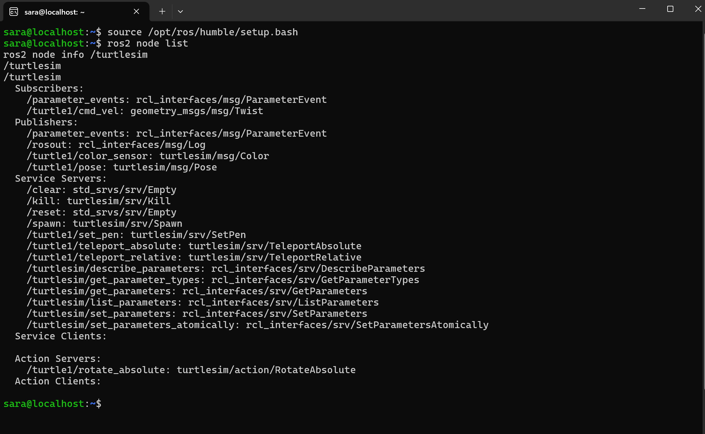
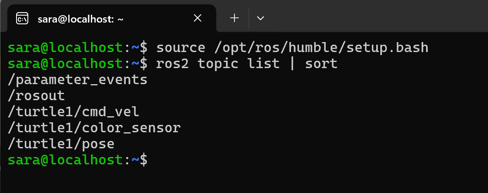
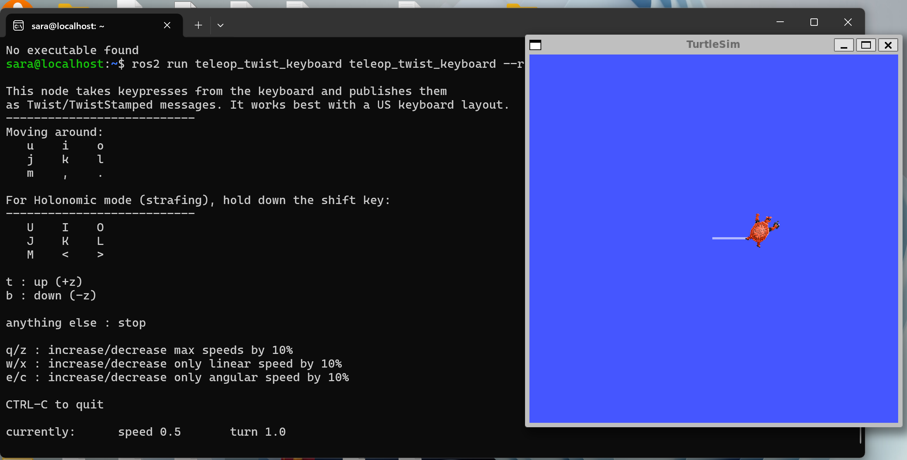
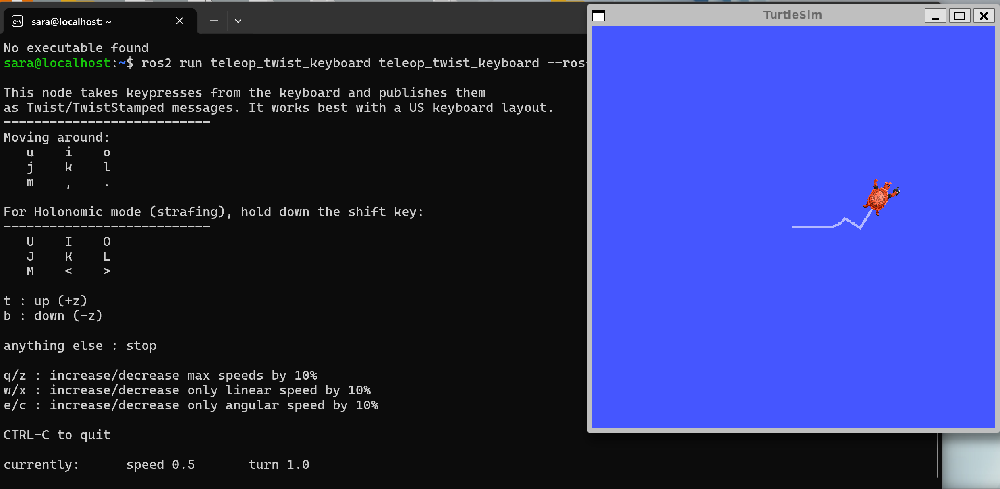

# ros2-turtlesim-manipulation
> 🎯 Quick **ROS 2 Humble** tutorial using **turtlesim** to learn **Nodes & Topics**

## 🚀 Quick Start

### 📱 Terminal 1 — Turtlesim
```bash
source /opt/ros/humble/setup.bash
ros2 run turtlesim turtlesim_node
```

### ⌨️ Terminal 2 — Control
```bash
source /opt/ros/humble/setup.bash
ros2 run teleop_twist_keyboard teleop_twist_keyboard --ros-args -r cmd_vel:=/turtle1/cmd_vel
```

## 📚 Key Concepts

### 🔧 Nodes
| Node | Function |
|------|----------|
| `/turtlesim` | Draws turtle & processes movement |
| `/teleop_twist_keyboard` | Converts keyboard input to commands |

### 📡 Topics
| Topic | Type | Purpose |
|-------|------|---------|
| `/turtle1/cmd_vel` | `geometry_msgs/Twist` | Movement commands |
| `/turtle1/pose` | `turtlesim/Pose` | Turtle position/orientation |

## 💻 Useful Commands

```bash
# List nodes and topics
ros2 node list
ros2 topic list | sort

# Get detailed info
ros2 node info /turtlesim
ros2 topic info /turtle1/cmd_vel

# Monitor messages
ros2 topic echo /turtle1/pose -n 5
```

## 📸 Screenshots

### 🖼️ Node Information

Shows `/turtlesim` node subscribers, publishers, and services.

### 📋 Topics List

Displays all active ROS 2 topics in the system.

### 🎮 Control Interface

Keyboard control terminal with TurtleSim window showing turtle movement.

### 🏃 Turtle in Motion

Turtle drawing a white path, demonstrating real-time control.

## ⚙️ Environment
- **OS**: Windows 11 + WSL2 (Ubuntu 22.04)
- **ROS**: Humble Hawksbill
- **Graphics**: WSLg

## 🎯 Learning Outcomes
- ✅ ROS 2 node management
- ✅ Topic-based communication
- ✅ Real-time robot control
- ✅ System introspection tools

---

**Built with ❤️ for ROS 2 Learning | Happy Coding! 🚀**
